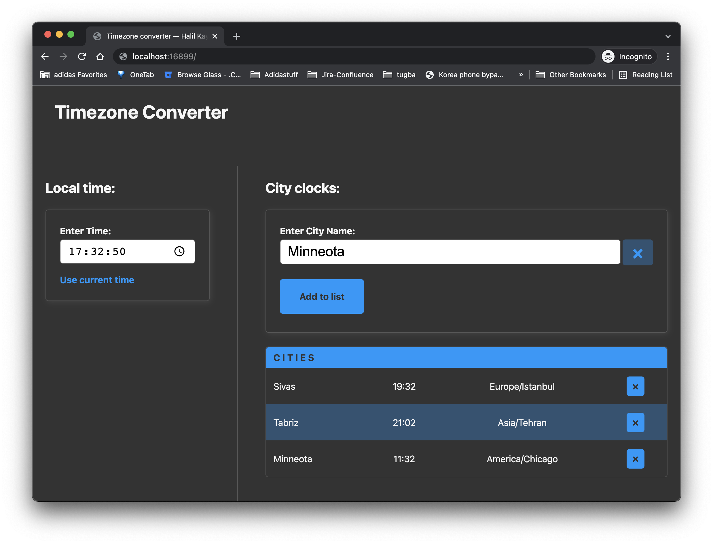

# Timezone App (Memsource Senior Frontend Challenge)

> Author: Halil Kayer


## Overview
This project is developed using react.js. React testing library and jest used for testing; mvp.css lies on its core styling and css modules is chosen for component styling. I choose Geonames' city API for city suggestion source (https://public.opendatasoft.com/explore/dataset/geonames-all-cities-with-a-population-1000/). There's a command at your disposal in order to run a proxy server of which proxying API in order not to hassle with CORS issues. Package manager is yarn v.3.1.1. Best thing of using yarn is, it does not require to be downloaded or installed on your system additionaly, already packed up and comes in the project just like the source code. Yet, there is a requirement for running  yarn v.3.1.1 which is node.js. It must be version 16.10 or above due to corepack capabilities. Yarn Plug'n'Play enabled (https://yarnpkg.com/features/pnp). So don't expect node_modules here in project after run `yarn install`. Parcel used for bundler, reason is shortened the time for creating and spinning up the project. Prettier is the formatting tool for all the js, json files. Default formatting settings used for the aforementioned files.


## Commands
First of all, please make sure your `node.js` version is equal to or higher than `16.10`. There's a `engines` entry in `package.json` so if you have lower version, unfortunately projects won't run any command.

Once you have the necessary `node.js` version available in your system, please enable `corepack` via

```shell
corepack enable
```

Corepack is included by default with all Node.js installs, but is currently opt-in. So you must make sure it's enabled by running the command above.
p.s Please be aware Node.js comes with yarn as well since v.16.9.0 (https://nodejs.org/ja/blog/release/v16.9.0/#corepack). 
>  Corepack will let you use Yarn and pnpm without having to install them - just like what currently happens with npm,

You can test it with

```shell
> where yarn 
/Users/kjaer/.nvm/versions/node/v16.13.2/bin/yarn
```

As a second step, dependencies should be installed via,

```shell
yarn install
```

these 2 commands must be run before we look to the other commands in the project

```shell
yarn start-proxy
```

It starts a proxy server for the city suggestion API. Proxy server's served from 15486 port (http://localhost:15486)

```shell
yarn start
```

It spins up the project locally and automatically opens the page in `chrome` browser. Project served from 16899 port (http://localhost:16899)

```shell
yarn test
```

Runs the tests with jest and react testing library. In order to run individual tests, you can only pass test file name with yarn test. e.g.

```shell
yarn test Timer.test.js
```
---

```shell
yarn test:debug
```

It attaches a debugger on `node.js` process and allow you to debug tests while they're running. You need to open `chrome` or `chromium` browser where you can open `chrome://inspect` page.

Lastly,

```shell
yarn format
```

and

```shell
yarn lint
```

Prettier commands that format and checks formatting of the code.

## Approach
While I am designing this solution, I try to keep as less re-rendering as possible. For sharing data between component, I took advantage of composing contextual units.

Application is contextually split in two sections:
- Clock
- City

In _Clock_, where user can enter a time, or clock-like timer counts on. In _City_, user can search city by making request to the city suggestion API, can add them to the list. In the city list, each city has relative time calculated by their timezone according to the _Clock_ input's time value.

In order to share data between these two contextually different sections, I prefer composing components instead of introducing _global store_. Of course this decision has cons and pros. Using only react and not introducing any store library/tool/tech, keep the project straight. Source code stands less complex and less boilerplate code required. It also means less file and folder. However, using only react.js has its own problems needed to taken care of. In order to move particular data between irrelevant components, requires data needed to be traversed up to the parent components first, then passed down to the destination component. This triggers many re-renderings. It usually not a big deal. We knew react.js is highly optimized for such re-renderings, but a specific case worried me:

**updating clock values in the city list based on the _Clock_ component's input value**

In a naive implementation, I would keep the clock value in state. Setting an interval in the same component and update the clock value in every second. Since I don't use any store tool (redux, mobx or my favourite recoil.js) I would have moved new clock value (in every second) to the very parent component until I can pass down to city table component. Once city table component receives new clock value from _Clock_ component, it has to update the clock values on the city list where it also kept in the state. Old clock values would be replacing new values, and all city list state should be re-created then set to its state. Keep repeating this cycle in every second.

This would be performing poor in scenarios like there are 1000 cities in the table. Considering, every second _Clock_ component counts seconds. This new clock value propagates up to the parent (It causes also parent re-renders), then passed down until city list component in which re-creates 1000 new city item with new clock value in order to update the state. This updated city list state array  will be _rendered_.

So here is my solution to mitigate this problem. First of all I decided to use `<input type="time" />` for clock input. It gains me UX by native clock selection and formatting, as well as I don't have to parse and create a date object which is a big operational chore every time. My step is updating clock. For this task I choose `valueAsDate` property of the input. So instead of keep the clock (11:10:09 ... 11:10:30) in the state and maintain it every second (parsing, re-creating clock value) I simply get local time by using `new Date()` with the timezone offset calculation and assign this to the `valueAsDate` property. I make this update happen by having the `ref` of clock input. So I kept `react` out of this heavy repetitive task and solve it just using DOM API. Big win here is, every second update does not trigger any re-render, even its own component.

There's still one problem stands, updating clock in the city list. Smaller size of the list won't make a significant performance problem. But, as the list grows, updating clock on large number of city arrat, rewrite it on state and re-render them every second poses a risk to make the app slow. So my solution for this, keeping clock dynamic (as function) in the state instead of static value like city name. So city list state will only require update whether city adds or removed. Every time city list receives the new clock value, it received via prop and only render the list again. Since state is intact, time kept as function in the state so during re-render, new clock value passed to clock function and new clock value returned.

As you would guess so far, I avoided update city list  clock in every second. Though solution, I introduce update city clocks on the list quite often.
So every time, user clicks the _Use current time_ link or set custom time, new clock value delivered to city list component. The same goes for the clock. Meaning, every time a new city added to or removed from city list component, a signal created and delivered to clock component. This signal causes clock component sets again a clock which reflected to city list. This duplex communication updates relevant info on the page quite enough.

## Resources
1. https://www.delftstack.com/howto/javascript/initialize-javascript-date-to-a-particular-timezone/
2. https://toastui.medium.com/handling-time-zone-in-javascript-547e67aa842d
3. https://www.bha.ee/how-to-setup-jest-test-runner-in-react-application-with-parcel-js/
4. https://www.peterbe.com/plog/how-to-throttle-and-debounce-an-autocomplete-input-in-react
5. https://codewithhugo.com/mocking-the-current-date-in-jest-tests/
6. https://stackoverflow.com/a/70610641/5018572
7. https://kentcdodds.com/blog/fix-the-not-wrapped-in-act-warning
8. https://data.opendatasoft.com/explore/dataset/geonames-all-cities-with-a-population-1000%40public/api/?disjunctive.country&disjunctive.cou_name_en&sort=name&q=tokat
9. https://opendata.stackexchange.com/a/7497
10. https://stackoverflow.com/a/58252034/5018572
11. https://stackoverflow.com/a/15171030/5018572
12. https://www.codegrepper.com/code-examples/javascript/get+browser+timezone+javascript
13. https://www.thisdot.co/blog/how-to-handle-time-zones-using-datetime-and-luxon
14. https://stackoverflow.com/a/50901817/5018572
